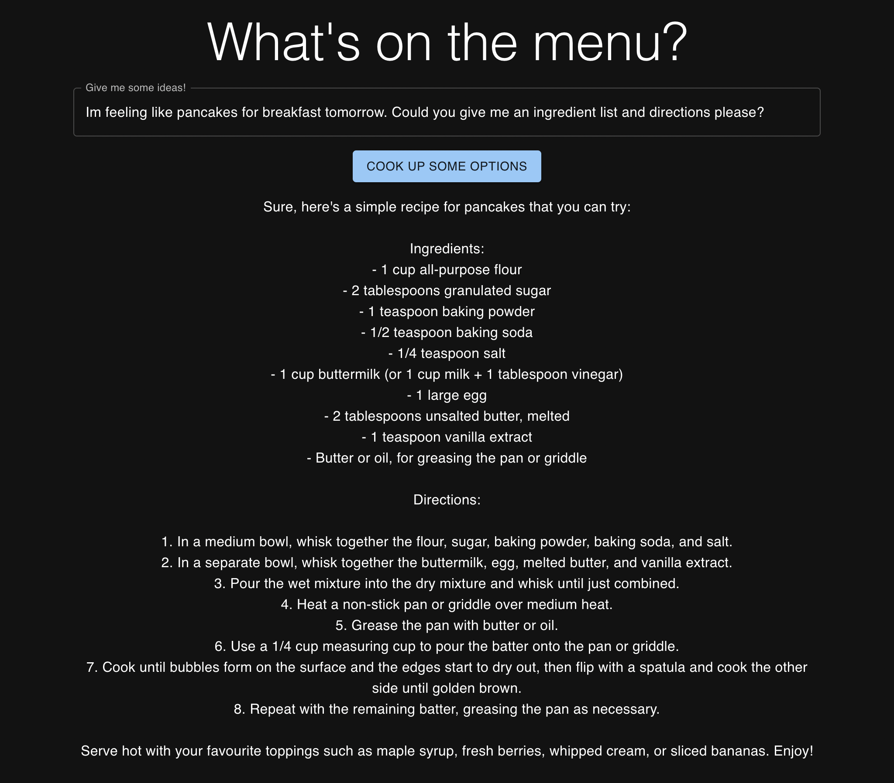

# whats-for-dinner

A simple project to test out the OpenAI GPT-3 API. This project is a simple web app that allows you to ask the API what you should have to eat.



## Technology

- [Next.js](https://nextjs.org/)
- [OpenAI GPT-3](https://openai.com/blog/openai-api/)
- [MUI](https://mui.com/)

## Getting Started

Setup the openai api key in the `.env.local` file (example inside the `.env.dummy` file)

```bash
npm install
npm run dev
```
